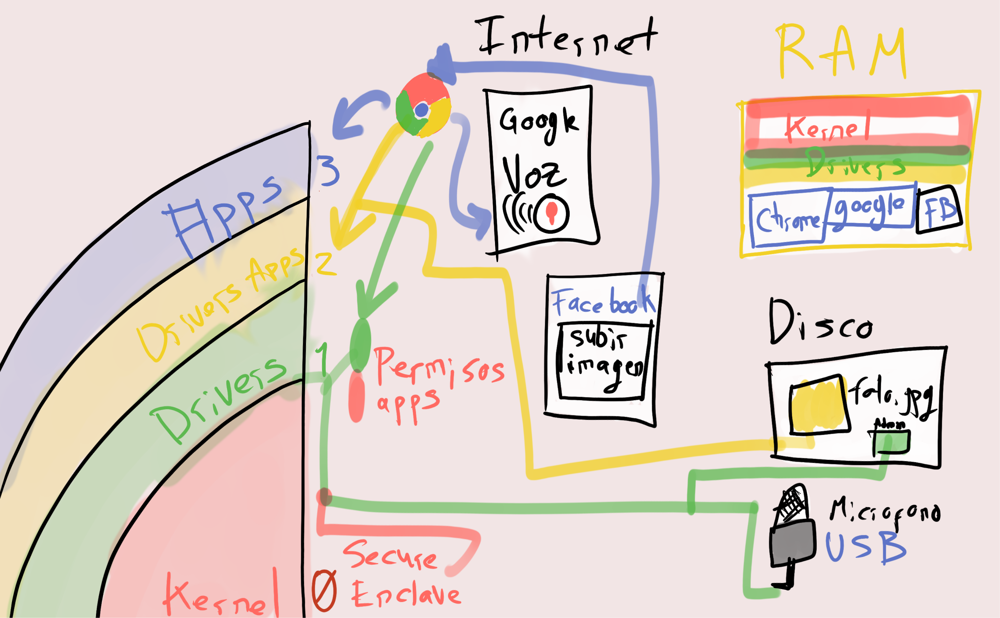

# Periféricos y sistemas de entrada de información

## Puntos claves:
### Anillos de poder - seguridad de software:

* Kernel Los sistemas operativos tienen un kernel

* El kernel tiene acceso a TODO

* Drivers El kernel carga los drivers
Son quienes interpretan las piezas de hardware

* Drivers especializados y de arranque

* Aplicaciones 
Permisos de las aplicaciones 
Periféricos 
Almacenamiento en disco duro 
Microfono 
Otros

## Sistema operativo como anillos:

**Primer anillo - Kernel:** El Kernel lo podemos entender como la capa mas profunda de nuestro S.O. por lo tanto tiene acceso completo a archivos, drivers, programas, etc…Igual que cualquier otro proceso, se carga en la RAM como la cualidad de que es lo primero en cargar.
En esta capa también viven programas capaces de encriptar y desencriptar información, de tal forma que ninguna otra capa del S.O. tenga acceso a ellos.

**Segundo anillo - Drivers:** Como se ha dicho antes los drivers son código que se encargan de interpretar las señales de el hardware y establecer una comunicación con el software del PC. Estos primeros drivers pertenecen a piezas de hardware bastante importantes como la pantalla, el teclado, el mouse, etc…
Es importante indicar que entre el primer y el segundo anillo hay un indice de permisos donde estan almacenados qué permisos tiene cada app

**Tercer anillo - Mas Drivers:** Otra capa de drivers carga en un tercer “puesto” en la RAM. Dado que están más alejados del Kernel, tienen menos permisos y privilegios que los drivers del segundo anillo. Dado que mediante los drivers de este anillo, se comunican en su mayoría las Apps, es necesario que primero los drivers del tercer anillo pidan permisos a los del segundo anillo para luego así comunicarse con el hardware.

**Cuarto anillo - Apps:** Finalmente en la última capa del modelo de anillos del S.O. nos encontramos con las apps, que se cargan en la RAM para ejecutar procesos. Sin embargo a diferencia de los otros anillos no tienen ningún tipo de acceso directo al hardware del PC. Es importante tener en cuenta que así debería ser, pues de lo contrario cualquier Software escrito por terceros tendría la capacidad de acceder casi por completo al PC y a sus piezas de Hardware.